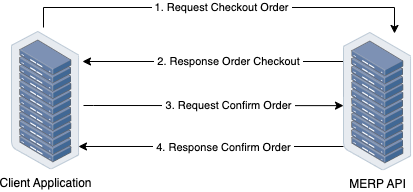

# Public API for Ventures 

### Contact Persons:

| Name | Email |
| --- | --- |
| Muhammad Hasni | muhammadhsn.hsn@gmail.com |
| Helmi Ruza | helmiruza@gmail.com |

### Order Creation Flow


### API Endpoints Document
Visit our [Swagger](https://micro-erp.github.io/swagger-api-ext-venture-ezqurban/) for our API Endpoints Document

### API Webhooks
Webhook is an callback event that will be triggered when a certain action has been made. For instance, when the order is created, our system will send a callback event to target url/endpoint. It is a `POST` request through `HTTP` protocol.

List of currently available events:
```javascript
[ 
  order.created, 
  order.confirmed, 
  order.executed, 
  order.completed, 
  order.cancelled 
]
```